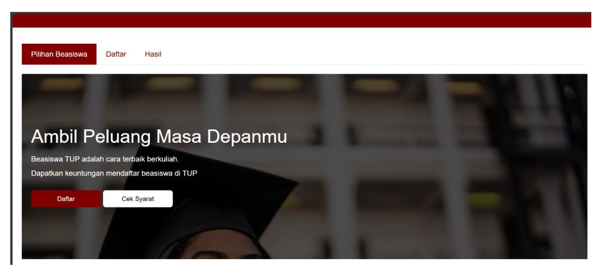

!(./serkom--lp.jpeg)

## Fungsi Menu

Aplikasi ini memiliki beberapa menu yang memudahkan navigasi:

- **Halaman Utama (`index.php`)**: Pengguna dapat mengisi formulir pendaftaran dan meng-upload berkas yang diperlukan.
- **Hasil Pendaftaran (`result.php`)**: Menampilkan statistik pendaftar dalam bentuk grafik serta tabel yang menunjukkan semua pendaftar.
- **Footer (`footer.php`)**: Berisi informasi tambahan dan navigasi ke halaman lain jika diperlukan.
- **Navigasi Tab (`tabBar.php`)**: Menyediakan akses mudah ke berbagai bagian aplikasi.

## Teknologi yang Digunakan

Proyek ini dibangun dengan menggunakan teknologi dan alat berikut:

- **Bahasa Pemrograman:**
  - **PHP**: Bahasa server-side yang digunakan untuk memproses data dan menghubungkan aplikasi dengan database.
  - **HTML**: Digunakan untuk struktur dan konten halaman web.
  - **CSS**: Digunakan untuk styling dan tampilan halaman.
  - **JavaScript**: Digunakan untuk interaktivitas dan pemrosesan di sisi klien, termasuk penggunaan grafik.

- **Database:**
  - **MySQL**: Database yang digunakan untuk menyimpan data pendaftar.

- **Framework dan Library:**
  - **Bootstrap**: Framework CSS untuk mempercepat pengembangan antarmuka yang responsif.
  - **Chart.js**: Library JavaScript untuk membuat grafik yang menampilkan statistik pendaftar.

## Cara Meng-clone Proyek

1. **Kloning repositori ini:**
   ```bash
   git clone https://github.com/username/repository.git
   cd repository
